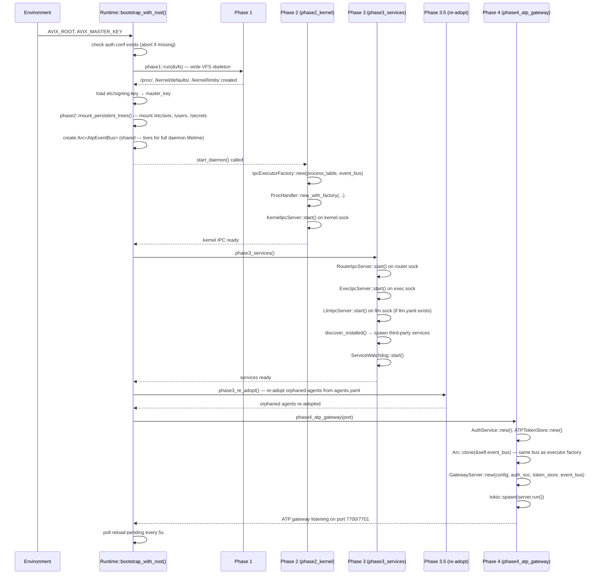
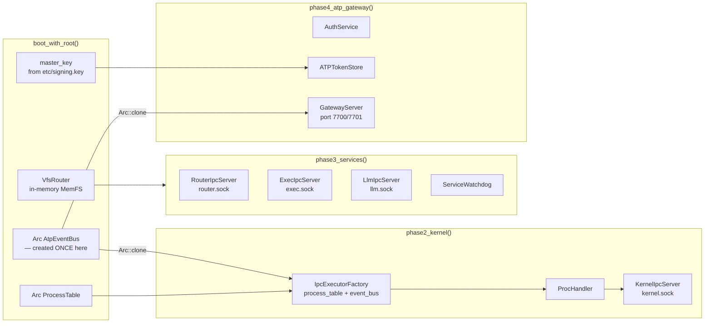

# 02 — Bootstrap

> Boot phases 0–4, VFS skeleton initialisation, config init, deployment modes,
> and the component wiring that happens at each phase.

---

## Prerequisites

`avix start` refuses to boot without:

1. `AVIX_ROOT/etc/auth.conf` — must exist and be parseable
2. `AVIX_MASTER_KEY` — must be set in the environment (Phase 2 reads it, then zeros the var)

Run `avix config init` before first start to generate all config files. There is no
"first-run wizard" or fallback mode inside the kernel.

---

## Boot Phases

Avix boots in five phases. The shared `AtpEventBus` is created at `Runtime` construction
so that `IpcExecutorFactory` (phase 2) and `GatewayServer` (phase 4) reference the same
broadcast channel — agent output events published by the executor reach ATP clients.



### Component Wiring by Phase



---

## Boot Phase Details

### Environment Variables

```bash
AVIX_ROOT=/var/avix-data       # host FS path — all config derived from here
AVIX_IPC_DIR=/run/avix         # platform-resolved socket directory
AVIX_MASTER_KEY=<key>          # secrets master key — zeroed after Phase 2
AVIX_LOG_LEVEL=info
```

### Phase 0 — Runtime Self-Init

- Parse env vars and CLI flags
- Allocate process table (PID 0 = runtime)
- Wire signal bus
- Initialise panic ring buffer
- Verify `AVIX_ROOT` is readable — exit 1 on failure

### Phase 1 — Fused Bootstrap + VFS Skeleton

This phase runs before config is loaded and writes the kernel-owned VFS trees into `MemFs`
so that agents spawned later can read system defaults from `/kernel/defaults/`.

**Phase 1 must write before Phase 2 runs:**

```
/proc/                              # directory anchor (empty at boot)
/proc/spawn-errors/                 # empty dir for failed spawn records
/kernel/                            # directory anchor
/kernel/defaults/                   # compiled-in system defaults
/kernel/defaults/agent.yaml         # AgentDefaults — context window, chain limits
/kernel/defaults/pipe.yaml          # PipeDefaults — buffer size, direction
/kernel/limits/                     # dynamic limits (kernel updates at runtime)
/kernel/limits/agent.yaml           # AgentLimits — per-agent resource ceilings
```

`/kernel/defaults/agent.yaml` content (compiled-in constants):

```yaml
apiVersion: avix/v1
kind: AgentDefaults
spec:
  contextWindowTokens: 64000
  maxToolChainLength: 50
  tokenTtlSecs: 3600
  renewalWindowSecs: 300
```

`/kernel/defaults/pipe.yaml`:

```yaml
apiVersion: avix/v1
kind: PipeDefaults
spec:
  bufferTokens: 8192
  direction: out
```

`/kernel/limits/agent.yaml`:

```yaml
apiVersion: avix/v1
kind: AgentLimits
spec:
  maxContextWindowTokens: 200000
  maxToolChainLength: 200
  maxConcurrentAgents: 100
```

Phase 1 also starts:
- **memfs** (local driver) — opens `AVIX_ROOT` on host FS, mounts as `/`
- **router** (in-process socket) — creates `AVIX_IPC_DIR/router.sock`
- **auth** (default caps only) — PID 0 gets `auth:admin`, no `auth.conf` yet
- **logger** — opens `/var/log/avix/boot.log`

**Implementation note:** All Phase 1 VFS writes call `MemFs::write()` directly — no syscall
layer, no agent permissions. These are kernel-internal writes.

### Phase 2 — Read Config + Kernel IPC

- Read `AVIX_ROOT/etc/kernel.yaml`
- Hot-swap memfs driver if `storage.driver ≠ local`
- Read `AVIX_ROOT/etc/auth.conf` — replace bootstrap auth with full policy
- Load `AVIX_MASTER_KEY` from configured source → held in memory only; **env var zeroed immediately**
- Validate — halt with structured error on any failure
- Create `IpcExecutorFactory` (with shared `AtpEventBus`)
- Start `KernelIpcServer` on `kernel.sock`

### Phase 3 — Service Boot

Built-in and installed services start in dependency order:

```
Ring-1 (built-in, checksum-verified):
  1. router.svc, auth.svc, memfs.svc, logger.svc  (already live from Pivot)

Ring-2 (built-in, checksum-verified):
  2. watcher.svc
  3. scheduler.svc
  4. tool-registry.svc
  5. exec.svc
  6. mcp-bridge.svc
  7. gateway.svc
  8. gui.svc           (if mode=gui)
  9. shell.svc         (if shell=true)

Ring-3 (installed services — signature-verified):
  10. Read /services/*/service.unit
      Sort by [after:] dependency order
      Spawn each as host OS process
      kernel/ipc/register each
      tool-registry.svc rescan after all up

Agents:
  11. kernel.agent     (always — LLM-optional)
  12. planner.agent, executor.agent, memory.agent, observer.agent
      (spawned by kernel.agent when LLM available)
```

Installed services fail independently — a broken service does not prevent boot.

### Phase 3.5 — Re-adopt Orphaned Agents

The kernel reads `agents.yaml` and re-adopts any agent processes that were running before
a restart. Re-adopted agents are added to the process table; their `/proc/` state files
are still on disk from the prior session.

### Phase 4 — ATP Gateway

- Parse `auth.conf`, create `AuthService` and `ATPTokenStore`
- Clone the shared `AtpEventBus` (same instance as `IpcExecutorFactory`)
- Create `GatewayServer` with both
- `tokio::spawn(server.run(test_mode))` — gateway is now live on ports 7700/7701

The shared `AtpEventBus` is the critical link: agent output events published by
`IpcExecutorFactory` during agent execution are immediately available to all connected
ATP clients through the broadcast channel.

### The Pivot — Re-exec Handoff

```
avix runtime forks:
  router.svc  → PID 2  (inherits router.sock fd)
  auth.svc    → PID 3  (inherits serialised auth state)
  logger.svc  → PID 4  (inherits open log fd)
  memfs.svc   → PID 5  (inherits all open file handles)

runtime becomes supervisor (PID 1):
  owns: process table, signal dispatch, re-exec of failed built-ins
```

---

## avix config init

`avix config init` is a pre-boot file generator run once before first start. Avix core
never configures itself.

### What it writes

| Path | Kind | Notes |
|------|------|-------|
| `<root>/etc/auth.conf` | `AuthConfig` | Credential hashes; API key printed once to stdout |
| `<root>/etc/kernel.yaml` | `KernelConfig` | Scheduler, memory, safety, models, IPC, secrets config |
| `<root>/etc/llm.yaml` | `LlmConfig` | Provider list with API key paths; see `08-llm-service.md` |
| `<root>/etc/users.yaml` | `UsersConfig` | Initialising user as first identity |
| `<root>/etc/crews.yaml` | `CrewsConfig` | Empty crew list |
| `<root>/etc/crontab.yaml` | `CrontabFile` | Empty scheduled jobs list |
| `<root>/etc/fstab.yaml` | `Fstab` | Local mounts for `etc`, `users/<identity>`, `secrets` |
| `<root>/data/users/<identity>/` | directory | User workspace backing directory |
| `<root>/secrets/` | directory | Secrets backing directory |

### Idempotency

`avix config init` without `--force` skips any file that already exists. Safe to run in
container entrypoints — subsequent runs are no-ops (file mtimes unchanged).

### CLI Usage

```bash
# Desktop app / CLI
avix config init \
  --root ~/avix-data \
  --user alice \
  --role admin \
  --credential-type api_key \
  --master-key-source key-file \
  --mode gui

# Docker — non-interactive
avix config init \
  --root /var/avix-data \
  --user avix-admin \
  --credential-type api_key \
  --api-key "$AVIX_ADMIN_API_KEY" \
  --master-key-source env \
  --mode headless \
  --non-interactive
```

---

## kernel.yaml Schema

`kernel.yaml` is the master runtime configuration file. All fields have defaults —
an empty `kernel.yaml` is valid. Fields use `camelCase`.

### scheduler

```yaml
scheduler:
  algorithm: priority_deadline   # priority_deadline | round_robin | fifo
  tickMs: 100
  preemption: true
  maxConcurrentAgents: 50
```

### memory

```yaml
memory:
  defaultContextLimit: 200000
  episodic:
    maxRetentionDays: 30
    maxRecordsPerAgent: 10000
  semantic:
    maxFactsPerAgent: 5000
  retrieval:
    defaultLimit: 5
    maxLimit: 20
    candidateFetchK: 20
    rrfK: 60
  spawn:
    episodicContextRecords: 5
    preferencesEnabled: true
    pinnedFactsEnabled: true
  sharing:
    enabled: true
    hilTimeoutSec: 600
    crossUserEnabled: false    # always false in v0.1
```

### safety

```yaml
safety:
  policyEngine: enabled          # enabled | disabled
  hilOnEscalation: true
  maxToolChainLength: 10
  blockedToolChains: []          # list of { pattern, reason }
```

`hilOnEscalation: true` means `SIGESCALATE` from an agent always triggers a HIL event
rather than auto-approving.

### models

Default LLM models used for built-in agents:

```yaml
models:
  default:  claude-sonnet-4      # used by planner, executor, memory agents
  kernel:   claude-opus-4        # used by kernel.agent
  fallback: claude-haiku-4       # used when default is unavailable
  temperature: 0.7
```

### ipc

```yaml
ipc:
  transport: local-ipc           # local-ipc | unix-socket
  socketName: avix-kernel        # logical name; platform resolves to actual path
  maxMessageBytes: 65536
  timeoutMs: 5000
```

### secrets (master key)

```yaml
masterKey:
  source: env                    # env | passphrase | key-file | kms-aws | kms-gcp | kms-azure | kms-vault
  envVar: AVIX_MASTER_KEY        # for source: env
  keyFile: /run/secrets/avix-mk  # for source: key-file
```

For passphrase-derived keys, additional KDF fields are accepted:
`kdfAlgorithm`, `kdfMemoryMb`, `kdfIterations`.

### observability

```yaml
observability:
  logLevel: info                 # debug | info | warn | error
  logPath: /var/log/avix/kernel.log
  metricsEnabled: true
  metricsPath: /var/log/avix/metrics/
  traceEnabled: false
```

---

## auth.conf Schema

```yaml
apiVersion: avix/v1
kind: AuthConfig

policy:
  session_ttl: 8h
  require_tls: true
  failed_auth_lockout_count: 5
  token_refresh_window: 5m

identities:
  - name: alice
    uid: 1001
    role: admin                       # guest | user | operator | admin
    credential:
      type: api_key                   # password | api_key
      key_hash: hmac-sha256:$...
      ip_allowlist: []
```

`credential.type: none` **does not exist** — all identities use `api_key` or `password`.

---

## Deployment Modes

| Mode | Use case | `gateway.bind` | Master key source |
|------|----------|----------------|-------------------|
| `gui` | Desktop app | localhost | OS keychain (env) |
| `cli` | Developer workstation | localhost | Key file or env |
| `headless` | Docker / CI | 0.0.0.0 | Docker secret / env |
| `headless` | Remote server | 0.0.0.0 | AWS KMS / GCP KMS / Vault |

The desktop app reads the API key from the OS keychain, derives the master key from
machine identity, and spawns `avix start` with `AVIX_MASTER_KEY` in env. The user never
sees a password prompt — "passwordless feel" achieved via OS keychain, not an unsecured mode.

---

## avix config reload

Reloads `kernel.yaml` and `auth.conf` from disk into a running avix instance without
restarting. The live config is hot-swapped; services are not restarted.

```bash
avix config reload --root ~/avix-data
```

Fields that cannot be hot-reloaded (e.g. IPC transport, master key source) require a
full `avix start` restart. The command reports which fields were reloaded successfully
and which were skipped.

---

## avix resolve

Runs the parameter resolution pipeline offline and prints the merged `ResolvedFile`
that would be written to `/proc/<pid>/resolved.yaml` for a given user. Useful for
debugging config precedence without spawning an agent.

```bash
# Resolve for a specific user
avix resolve --root ~/avix-data --user alice

# Resolve for a user + crew intersection
avix resolve --root ~/avix-data --user alice --crew researchers
```

Output is the YAML `ResolvedFile` that would be written to the VFS, showing the
winning value for every parameter and the source that provided it.

---

## Implementation Notes

- `phase1::run(memfs: &MemFs)` writes all VFS skeleton paths. It calls `MemFs::write()`
  directly — no syscall handler, no capability check.
- `phase1::run` must complete and be logged before Phase 2 (`AVIX_MASTER_KEY` loading) starts.
- `avix config init` uses a `write_if_absent(path, content)` helper — only writes if the file
  does not already exist, ensuring idempotency without needing a `--force` flag.
- `AtpEventBus` is created in `bootstrap_with_root` and held on `Runtime`. Both
  `IpcExecutorFactory` (phase 2) and `GatewayServer` (phase 4) receive `Arc::clone` of the
  same instance. This is the critical wiring that allows agent output to reach ATP clients.
