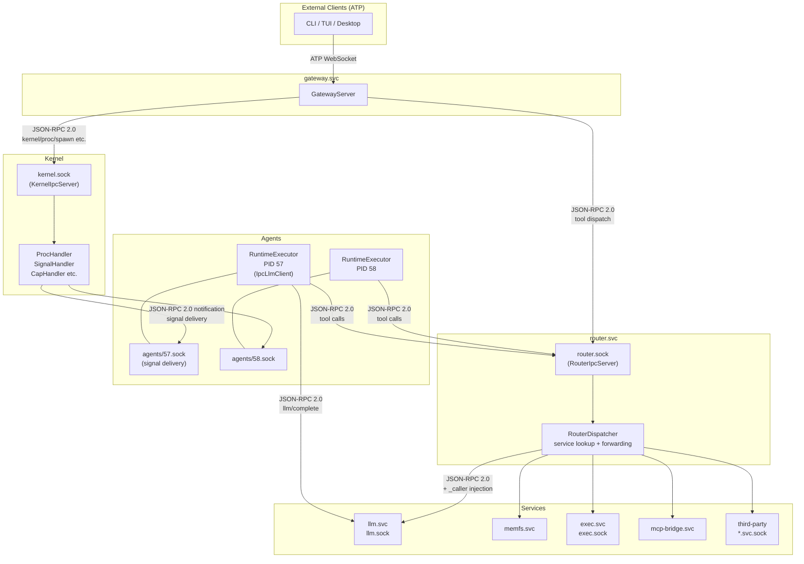
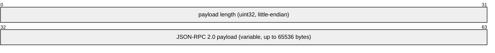
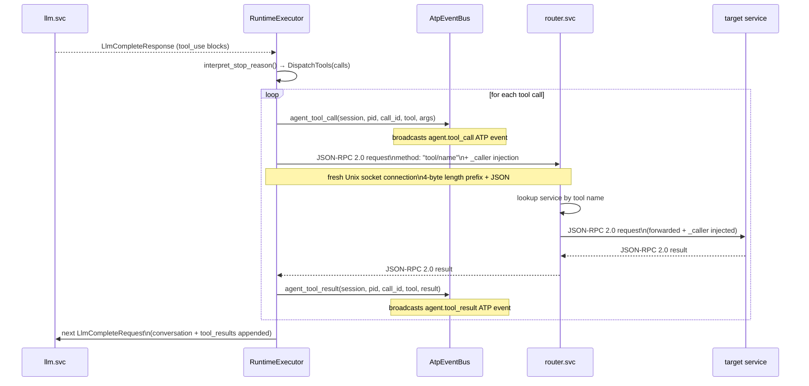
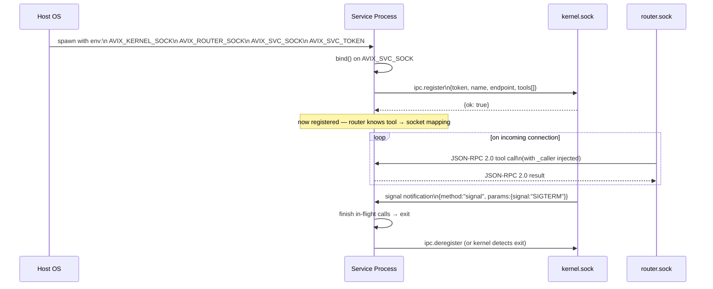
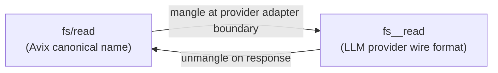

# 03 — IPC Protocol

> Internal communication between all Avix processes.
> Completely separate from ATP (the external protocol).

---

## Overview

The IPC protocol is the backbone of all internal communication in Avix. Every tool call,
service registration, signal delivery, and kernel syscall goes through IPC. It is:

- **JSON-RPC 2.0** over platform-native local sockets
- **4-byte little-endian length-prefix framing** — no line delimiters, no HTTP overhead
- **Fresh connection per call** — no persistent multiplexed channels
- **Language-agnostic** — any language with a socket and JSON library can implement it

---

## Component Topology



---

## Transport

Platform-native local sockets:

| Platform | Mechanism | Socket path pattern |
|----------|-----------|---------------------|
| Linux | AF_UNIX domain socket | `/run/avix/<name>.sock` |
| macOS | AF_UNIX domain socket | `/run/avix/<name>.sock` |
| Windows ≥10 1803 | Named Pipe | `\\.\pipe\avix-<name>` |

The kernel resolves the platform path from a logical name. Config, env vars, and service
code use only the logical name. The `AVIX_KERNEL_SOCK` and `AVIX_ROUTER_SOCK` env vars
contain the already-resolved OS path.

**Never hard-code socket paths.** Use `AVIX_KERNEL_SOCK`, `AVIX_ROUTER_SOCK`, `AVIX_SVC_SOCK`.

---

## Wire Format

Every message — in both directions, on all platforms — uses the same framing:

```
┌─────────────────────────────────────────┐
│  4 bytes: payload length (uint32, LE)   │
├─────────────────────────────────────────┤
│  N bytes: UTF-8 JSON (JSON-RPC 2.0)     │
└─────────────────────────────────────────┘
```

Read 4 bytes → parse length → read exactly N bytes → parse JSON.
Maximum frame size: 65536 bytes (configurable in `kernel.yaml`).



---

## Connection Model

**Fresh connection per call** — not persistent multiplexed connections.

Every tool call opens a fresh connection to `router.svc`, dispatches, waits for response,
and closes. This gives services natural per-call concurrency — each incoming connection is
an independent call handled in its own async task. It eliminates ordering bugs and makes
concurrency reasoning trivial.

**Long-running tools** return a `job_id` immediately. Progress is emitted via `jobs.svc`.
The caller polls or subscribes to job events rather than holding the connection open.

### Streaming extension: `serve_bidir()`

For streaming calls (`llm/stream_complete`), the connection model is extended: **one
connection per logical streaming call, held open until the stream ends**. There is no
multiplexing — each call still gets its own connection, but the server writes multiple
notification frames before the final response.

`IpcServer` exposes a second server mode for this pattern:

```rust
// Standard: handler receives message, returns optional response
pub async fn serve<F>(self, handler: F)

// Streaming: handler also receives OwnedWriteHalf to push notifications
pub async fn serve_bidir<F>(self, handler: F)
```

In `serve_bidir`, the connection is split into read and write halves at accept time.
The write half is passed to the handler so it can push `JsonRpcNotification` frames
before writing the final `JsonRpcResponse`. This is currently used only by `llm.svc`
for `llm/stream_complete`. See **[13-streaming.md](13-streaming.md)**.

---

## JSON-RPC 2.0 Message Format

### Request

```json
{
  "jsonrpc": "2.0",
  "id": "call-abc",
  "method": "fs/read",
  "params": {
    "path": "/users/alice/workspace/report.md",
    "_caller": {
      "pid": 57,
      "user": "alice",
      "token": "eyJ..."
    }
  }
}
```

### Success Response

```json
{
  "jsonrpc": "2.0",
  "id": "call-abc",
  "result": {
    "content": "# Q3 Report\n..."
  }
}
```

### Error Response

```json
{
  "jsonrpc": "2.0",
  "id": "call-abc",
  "error": {
    "code": -32003,
    "message": "File not found: /users/alice/workspace/report.md"
  }
}
```

### Signal (notification — no response)

```json
{
  "jsonrpc": "2.0",
  "method": "signal",
  "params": {
    "signal": "SIGPAUSE",
    "payload": { "hilId": "hil-001", "reason": "tool call requires approval" }
  }
}
```

---

## Tool Call Dispatch Flow

The full path of an agent tool call from LLM response to result:



---

## Service Startup Sequence

Every service — in any language — follows this protocol:



**1. Read environment:**

```
AVIX_KERNEL_SOCK  → resolved path to kernel socket
AVIX_ROUTER_SOCK  → resolved path to router socket
AVIX_SVC_SOCK     → resolved path for THIS service to listen on
AVIX_SVC_TOKEN    → service identity token
```

**2. Register with kernel:**

```json
{
  "jsonrpc": "2.0", "id": "1", "method": "ipc.register",
  "params": {
    "token": "<AVIX_SVC_TOKEN>",
    "name": "my-svc",
    "endpoint": "<AVIX_SVC_SOCK>",
    "tools": ["my-svc/tool-a", "my-svc/tool-b"]
  }
}
```

**3. Listen on `AVIX_SVC_SOCK` for incoming tool calls:**

```json
// Incoming (from router):
{
  "jsonrpc": "2.0", "id": "call-abc", "method": "my-svc/tool-a",
  "params": { "arg": "value", "_caller": { "pid": 57, "user": "alice", "token": "..." } }
}

// Response:
{ "jsonrpc": "2.0", "id": "call-abc", "result": { ... } }
```

**4. Make outgoing calls via router:**

```json
{ "jsonrpc": "2.0", "id": "out-1", "method": "fs/read",
  "params": { "path": "/services/my-svc/workspace/data.json", "_token": "<AVIX_SVC_TOKEN>" } }
```

**5. Handle inbound signals (no response expected):**

```json
{ "jsonrpc": "2.0", "method": "signal", "params": { "signal": "SIGTERM", "payload": {} } }
```

`SIGTERM` → finish in-flight calls → exit cleanly.

---

## `_caller` Injection

The router injects `_caller` into every tool call forwarded to a service:

```json
"_caller": {
  "pid": 57,
  "user": "alice",
  "token": "eyJ..."
}
```

Services that serve multiple users declare `caller_scoped: true` in `service.yaml` and use
`_caller.user` to scope per-user behavior (e.g., resolve the correct credential from
`/secrets/alice/`). The kernel enforces tool ACLs before the call reaches the service —
unauthorized calls never arrive.

---

## Tool Name Mangling

Avix tool names use `/` as the namespace separator. When passed on the wire to LLM provider
APIs (which may not support `/`), the router mangles the name:

```
Avix name:  fs/read
Wire name:  fs__read   (__ = double underscore)
```



**No Avix tool name ever contains `__`.** This is reserved exclusively for wire mangling.
`ToolName::parse` rejects any name containing `__`. Adapters translate at the boundary.

The mangling only happens between `RuntimeExecutor` and the LLM provider API inside `llm.svc`.
All other IPC — router calls, service-to-service — uses the canonical `/` form.

---

## Concurrency and Backpressure

Services declare capacity in `service.yaml`:

```yaml
service:
  max_concurrent: 20    # router queues calls beyond this
  queue_max:      100   # calls beyond this get EBUSY immediately
  queue_timeout:  5s    # queued call timeout before ETIMEOUT
```

---

## Error Codes

| Code | Meaning |
|------|---------|
| -32700 | Parse error (JSON-RPC standard) |
| -32601 | Method not found |
| -32602 | Invalid params |
| -32001 | Auth failed — bad or expired token |
| -32002 | Permission denied (`EPERM`) |
| -32003 | Resource not found |
| -32004 | Rate limited / quota exceeded |
| -32005 | Tool unavailable |
| -32006 | Conflict |
| -32007 | Timeout (`ETIMEOUT`) |
| -32008 | Service at capacity (`EBUSY`) |

---

## Kernel Syscalls — /tools/kernel/

All 32 kernel syscalls require `kernel:root` capability. All are synchronous.

| Domain | Path | Count | Linux analog |
|--------|------|-------|--------------|
| Process lifecycle | `kernel/proc/` | 8 | `fork`, `exec`, `waitpid`, `kill` |
| Signal bus | `kernel/signal/` | 4 | `kill`, `sigaction` |
| IPC registry | `kernel/ipc/` | 7 | `bind`, `connect`, service discovery |
| Capability authority | `kernel/cap/` | 5 | `capset`, sudoers |
| MemFS namespace | `kernel/mem/` | 5 | `mount`, `umount` |
| System lifecycle | `kernel/sys/` | 5 | `reboot`, `syslog` |

`kernel/ipc/` syscalls:

| Syscall | Description |
|---------|-------------|
| `register` | Register a service with its tools |
| `deregister` | Remove a service registration |
| `lookup` | Find a service endpoint by name |
| `list` | List registered services |
| `health` | Check service health |
| `tool-add` | Dynamically add tools to a service (used by RuntimeExecutor at spawn) |
| `tool-remove` | Dynamically remove tools from a service (used by RuntimeExecutor at exit) |
