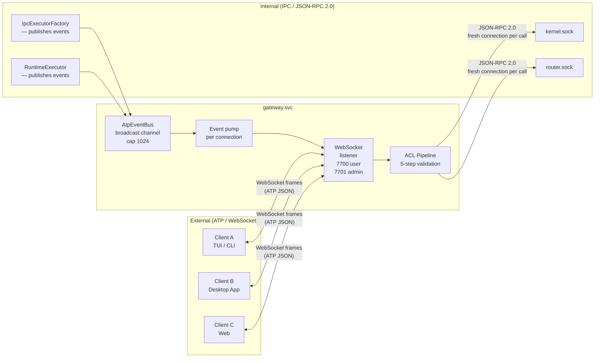
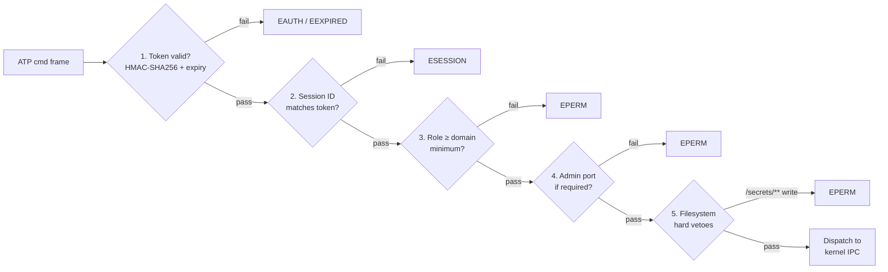
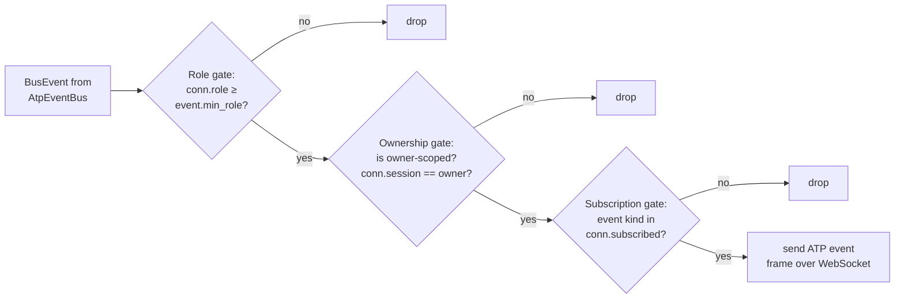
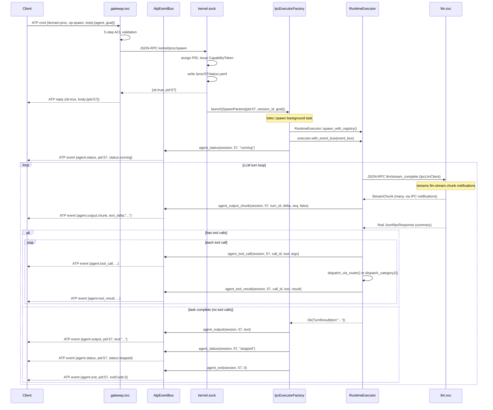
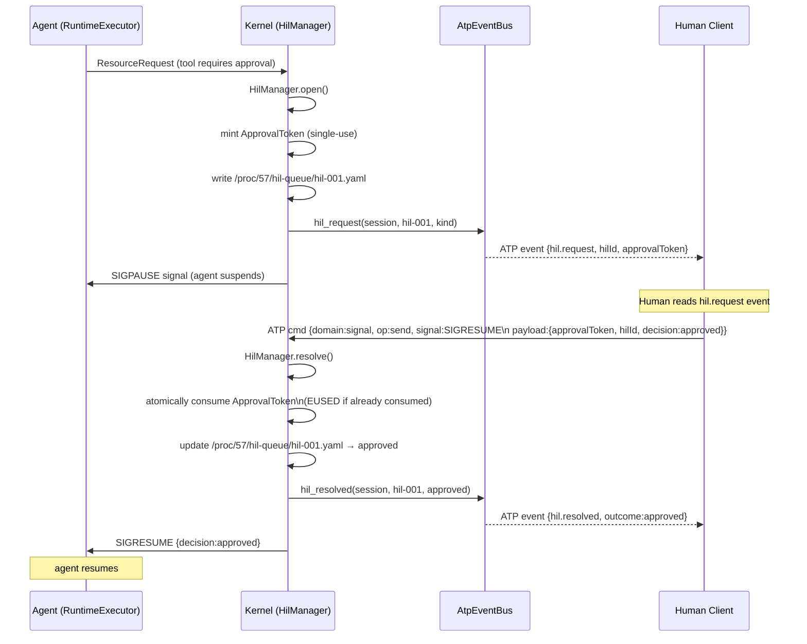
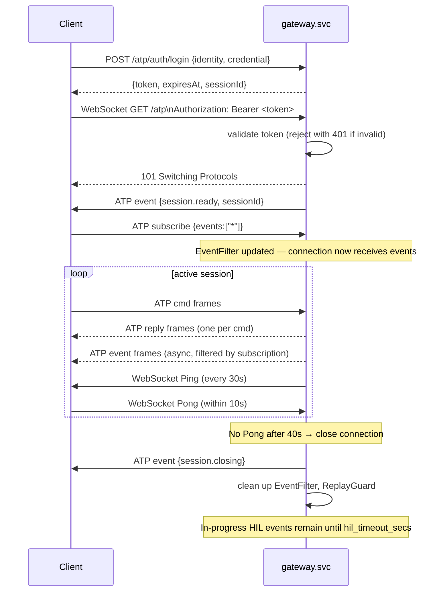

# 04 — Avix Terminal Protocol (ATP)

> The external communication layer between clients and the Avix runtime.
> ATP never crosses inside — `gateway.svc` is the sole translator.

---

## Overview

ATP (Avix Terminal Protocol) is the **external** protocol for all client-to-Avix
communication. It runs over WebSocket with TLS.

```
EXTERNAL — clients ↔ Avix             INTERNAL — inside Avix
────────────────────────────          ─────────────────────────────────
ATP over WebSocket (TLS)              JSON-RPC 2.0 over local IPC sockets
Human users, apps, tooling            Services, agents, kernel
Authenticated via ATPToken            Authenticated via CapabilityToken / SvcToken
gateway.svc is the sole boundary      router.svc is the backbone
Long-lived, reconnectable             Fresh connection per call
```

**Key rule:** ATP never enters the system. `gateway.svc` is the only component that
speaks both protocols — it translates ATP commands into IPC tool calls and translates
IPC results back into ATP events. The internal world never speaks ATP.

---

## Gateway: The Protocol Bridge

`gateway.svc` sits at the boundary between the external ATP world and the internal
IPC world. It is the only component that speaks both protocols.



### Inbound (Client → Avix)

ATP `cmd` frames arrive over WebSocket. The gateway:
1. Validates the bearer token (HMAC-SHA256 + expiry)
2. Checks the session ID, role, and port ACLs
3. Translates to a JSON-RPC 2.0 call on `kernel.sock` or `router.sock`
4. Returns the IPC result as an ATP `reply` frame

### Outbound (Avix → Client)

Events are published to `AtpEventBus` (a tokio `broadcast::Sender<BusEvent>` with
capacity 1024) from two sources:
- **`IpcExecutorFactory`** — publishes `agent.status`, `agent.output`, and `agent.exit`
  when an executor starts, finishes a turn, or exits
- **`RuntimeExecutor`** — publishes `agent.tool_call` and `agent.tool_result`
  mid-turn as tool calls are dispatched and results collected

Each WebSocket connection has an independent `broadcast::Receiver` subscribed to the bus.
A per-connection event pump task reads from the receiver, applies a three-gate filter
(`EventFilter`), and sends matching events as ATP `event` frames over WebSocket.

---

## Endpoints and Configuration

| Port | Purpose | Accessible by |
|------|---------|---------------|
| 7700 | User endpoint | Users with `user` role or above |
| 7701 | Admin endpoint | Required for `cap` domain and mutating `sys` ops |

Bind address is controlled by deployment mode:
- `localhost` for `gui` and `cli` modes
- `0.0.0.0` for `headless` (Docker / remote server)

### GatewayConfig

`gateway.svc` is configured via `GatewayConfig` embedded in the kernel:

| Field | Default | Description |
|-------|---------|-------------|
| `user_addr` | `127.0.0.1:7700` | User WebSocket endpoint bind address |
| `admin_addr` | `127.0.0.1:7701` | Admin WebSocket endpoint bind address |
| `tls_enabled` | `false` (dev/test) | Enable TLS — must be `true` in production |
| `hil_timeout_secs` | `600` | Seconds before a pending HIL request is auto-denied |
| `kernel_sock` | env `AVIX_KERNEL_SOCK` | Path to the kernel IPC socket |

If `kernel_sock` is not set in config, `gateway.svc` reads `AVIX_KERNEL_SOCK` from the
environment. If neither is set, all IPC calls return `EUNAVAIL`.

---

## Authentication

Clients authenticate over ATP using an `ATPToken` (also called an API key or session token).

### Login

```http
POST /atp/auth/login
Content-Type: application/json

{ "identity": "alice", "credential": "<api_key_or_password>" }
```

Response:
```json
{
  "token": "eyJ...",
  "expiresAt": "2026-03-22T20:00:00Z",
  "sessionId": "sess-abc-123"
}
```

### WebSocket Upgrade

The token is presented on every WebSocket connection as an HTTP `Authorization` header:

```
GET /atp HTTP/1.1
Authorization: Bearer eyJ...
```

`gateway.svc` validates the token **before upgrading the connection**. An invalid or
missing token returns `401 UNAUTHORIZED` and the upgrade is rejected.

The plaintext token is **never stored** — only the HMAC-SHA256 hash in `auth.conf`.

---

## Message Format

ATP messages are JSON objects sent over the WebSocket connection.

### Client → Server: Command frame

Every command frame carries the bearer token:

```json
{
  "type": "cmd",
  "id":   "req-001",
  "token": "eyJ...",
  "domain": "proc",
  "op":    "spawn",
  "body": {
    "agent": "researcher",
    "goal": "Summarise Q3 earnings report"
  }
}
```

| Field | Type | Description |
|-------|------|-------------|
| `type` | `"cmd"` | Must be the literal string `"cmd"` |
| `id` | string | Client-assigned unique ID (per connection) — used for replay protection |
| `token` | string | ATPToken issued by `/atp/auth/login` |
| `domain` | string | One of the 11 command domains |
| `op` | string | Operation within the domain |
| `body` | object | Domain-specific parameters |

### Client → Server: Subscribe frame

After connecting, clients send a subscribe frame to select which events to receive.
Without a subscription, no server-push events are delivered.

```json
{
  "type": "subscribe",
  "events": ["agent.output", "agent.status", "hil.request", "hil.resolved"]
}
```

Use `"*"` to subscribe to all events permitted by the connection's role:

```json
{ "type": "subscribe", "events": ["*"] }
```

### Server → Client: Reply frame

Every `cmd` gets exactly one `reply`:

```json
{
  "type":  "reply",
  "id":    "req-001",
  "ok":    true,
  "body":  { "pid": 57 }
}
```

Error reply:
```json
{
  "type":  "reply",
  "id":    "req-001",
  "ok":    false,
  "error": {
    "code":    "EPERM",
    "message": "Insufficient role to spawn agents",
    "detail":  { "required_role": "user" }
  }
}
```

### Server → Client: Event frame (server-push)

```json
{
  "type":      "event",
  "event":     "agent.output",
  "sessionId": "sess-abc-123",
  "body":      { "pid": 57, "text": "Analysing Q3 data..." }
}
```

---

## ATP Error Codes

All errors carry a `code` field (SCREAMING_SNAKE_CASE):

| Code | Meaning |
|------|---------|
| `EAUTH` | Invalid or missing token (401) |
| `EEXPIRED` | Token expired (401) |
| `ESESSION` | Session ID mismatch (401) |
| `EPERM` | Insufficient role (403) |
| `ENOTFOUND` | Target does not exist (404) |
| `ECONFLICT` | Operation conflicts with current state (409) |
| `EUSED` | ApprovalToken already consumed (409) |
| `ELIMIT` | Quota exceeded (429) |
| `EPARSE` | Malformed message or unknown operation (400) |
| `EINTERNAL` | Kernel-side error (500) |
| `EUNAVAIL` | Target service not running (503) |

---

## Command Domains

The 11 ATP command domains map directly to kernel IPC namespaces:

| Domain | Description | Min role | Ops |
|--------|-------------|----------|-----|
| `auth` | Login, logout, token management | `guest` | `whoami`, `refresh`, `logout`, `sessions`, `kick` |
| `proc` | Spawn, kill, stat agents | `user` | `spawn`, `kill`, `list`, `stat`, `pause`, `resume`, `wait`, `setcap` |
| `signal` | Send signals to agents | `user` | `send`, `subscribe`, `unsubscribe`, `list` |
| `fs` | VFS read/write/watch | `user` | `read`, `write`, `list`, `stat`, `watch`, `unwatch` |
| `snap` | Agent snapshots | `user` | `create`, `list`, `restore`, `delete` |
| `cron` | Scheduled jobs | `user` | `list`, `add`, `remove`, `pause`, `resume` |
| `users` | User management | `user`/`operator`¹ | `get`, `list`, `create`, `update`, `delete`, `passwd` |
| `crews` | Crew management | `user` | `list`, `get`, `create`, `update`, `delete`, `join`, `leave` |
| `cap` | Capability inspection and grants | `user` | `inspect`, `grant`, `revoke`, `policy/get`, `policy/set` |
| `sys` | System administration | `operator`/`admin`² | `status`, `reload`, `shutdown`, `restart`, `logs`, `install`, `uninstall`, `update` |
| `pipe` | Inter-agent pipes | `user` | `open`, `close`, `list` |

¹ `users.get` requires `operator` to read another user's record; users may only read their own.
² `cap` domain and mutating `sys` ops (`install`, `uninstall`, `update`, `shutdown`, `restart`, `reload`) require the **admin port (7701)**.

### Access Control Pipeline

Each command passes through a five-step ACL pipeline before dispatch:



1. **Token validation** — HMAC-SHA256 + expiry check; `EAUTH`/`EEXPIRED` on failure
2. **Session ID check** — token's `session_id` must match the connection's session; `ESESSION` on mismatch
3. **Domain × role matrix** — minimum role per domain enforced; `EPERM` on failure
4. **Admin port gate** — `cap` domain and mutating `sys` ops require port 7701; `EPERM` on user port
5. **Filesystem hard vetoes** — `fs.write` and `fs.stat` on `/secrets/**` always return `EPERM` regardless of role

Additionally, **replay protection** is enforced per-connection: a command `id` that has been
seen before on the same WebSocket connection returns `EPARSE` immediately.

---

## Server-Push Events

The 21 server-push event kinds with their scoping rules:

| Event | Min role | Owner-scoped¹ | When emitted | Source |
|-------|----------|:---:|---|---|
| `session.ready` | `guest` | yes | WebSocket upgrade succeeded | gateway |
| `session.closing` | `guest` | yes | Session is being terminated | gateway |
| `token.expiring` | `guest` | yes | Bearer token within renewal window | gateway |
| `agent.output` | `user` | yes | LLM turn complete — full accumulated text | IpcExecutorFactory |
| `agent.output.chunk` | `user` | yes | One token delta during a streaming LLM turn | RuntimeExecutor |
| `agent.status` | `user` | yes | Agent status changed | IpcExecutorFactory |
| `agent.tool_call` | `user` | yes | Agent dispatching a tool call | RuntimeExecutor |
| `agent.tool_result` | `user` | yes | Tool call result received | RuntimeExecutor |
| `agent.exit` | `user` | yes | Agent process exited (exit code in body) | IpcExecutorFactory |
| `agent.spawned` | `user` | yes | New agent process started | kernel |
| `proc.signal` | `user` | yes | Signal delivered to agent | kernel |
| `proc.start` | `user` | yes | Process started | kernel |
| `proc.output` | `user` | yes | Process stdout/stderr output | kernel |
| `proc.exit` | `user` | yes | Process exited | kernel |
| `hil.request` | `user` | yes | Human input required | kernel |
| `hil.resolved` | `user` | yes | HIL approved, denied, or timed out | kernel |
| `fs.changed` | `user` | yes | Watched VFS path was modified | memfs.svc |
| `tool.changed` | `guest` | no | Service added or removed a tool | kernel |
| `cron.fired` | `user` | yes | Scheduled cron job triggered | scheduler.svc |
| `sys.service` | `admin` | no | System service lifecycle event | kernel |
| `sys.alert` | `operator` | no | System-wide alert | kernel |

¹ Owner-scoped events are delivered only to the session that owns the event. Users with
`operator` role or above can receive events from any session.

### Event Bus Subscription Gates

The gateway enforces three gates before delivering an event to a connection:



1. **Role gate** — connection's role must meet event's minimum role requirement
2. **Ownership gate** — for owner-scoped events, `owner_session` must match (unless `operator+`)
3. **Subscription gate** — event kind must be in the connection's subscribed list (or `"*"`)

Events not passing all three gates are silently dropped per-connection.

---

## Agent Spawn and Output Event Flow

The full path from `proc.spawn` command to `agent.output` event reaching the client:



> For the full streaming pipeline detail (SSE parsing, IPC notification protocol,
> `turn_id` correlation) see **[13-streaming.md](13-streaming.md)**.

---

## Key Commands

### Spawn an agent

```json
{
  "type": "cmd", "domain": "proc", "op": "spawn", "id": "req-001",
  "token": "eyJ...",
  "body": {
    "agent": "researcher",
    "goal": "Summarise the Q3 earnings report in /users/alice/workspace/q3.pdf",
    "capabilities": ["fs/read", "llm/complete"]
  }
}
```

### Send a signal to an agent

```json
{
  "type": "cmd", "domain": "signal", "op": "send", "id": "req-002",
  "token": "eyJ...",
  "body": { "signal": "SIGKILL", "target": 57 }
}
```

### SIGPIPE — pipe a message to an agent

The `SIGPIPE` signal carries a typed payload. The gateway validates the payload before
forwarding to the kernel:

```json
{
  "type": "cmd", "domain": "signal", "op": "send", "id": "req-003",
  "token": "eyJ...",
  "body": {
    "signal": "SIGPIPE",
    "target": 57,
    "payload": {
      "text": "Here is the updated brief:",
      "attachments": [
        {
          "type": "inline",
          "content_type": "text/plain",
          "encoding": "base64",
          "data": "<base64-encoded-content>",
          "label": "brief.txt"
        }
      ]
    }
  }
}
```

Attachment types:
- `inline` — base64-encoded data embedded in the message; `encoding` must be `"base64"`
- `vfs_ref` — reference to a VFS path (`path` field); must be absolute; `/secrets/**` is rejected

### Install a service

```json
{
  "type": "cmd", "domain": "sys", "op": "install", "id": "req-004",
  "token": "eyJ...",
  "body": {
    "type": "service",
    "source": "https://pkg.avix.dev/github-svc-1.2.0.tar.gz",
    "checksum": "sha256:abc123..."
  }
}
```

---

## HIL (Human-in-Loop) Flow

When an agent needs human approval, the full flow is:



**Timeout path:** If no response arrives within `hil_timeout_secs`, `HilManager` automatically:
- Updates the VFS file state to `timeout`
- Sends `SIGRESUME { decision: "timeout" }` to the agent
- Pushes `hil.resolved { outcome: "timeout" }` ATP event

`ApprovalToken` is single-use and atomically consumed. The first valid `SIGRESUME` with
`approvalToken` invalidates all others. Subsequent attempts return `EUSED`.

---

## Connection Lifecycle



---

## Replay Protection

The gateway maintains a per-connection `ReplayGuard` (an in-memory set of seen command
IDs). If a client sends the same `id` twice on the same connection, the second command
returns `EPARSE` immediately. This prevents accidental retries from creating duplicate
side effects.

Replay state is **per-connection** — the same `id` can be reused across separate
WebSocket connections.

## End-to-End Integration Tests

End-to-end ATP WebSocket integration tests are in `crates/avix-tests-integration`.

**Coverage:**
* `basic` — successful spawn + output
* `errors` — auth/perm failures
* `events` — subscription + delivery
* `lifecycle` — connect/disconnect/session
* `full_errors` — Gap4 kernel-unavailable mocks
* `reconnect` — WS reconnect handling

**Run:**
```
cargo test -p avix-tests-integration
```

**Status:** Partial coverage. Tests require `--test-mode` server (IPC mocks via env).

---
