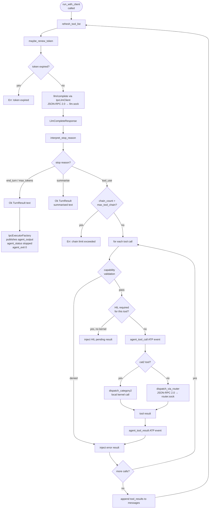
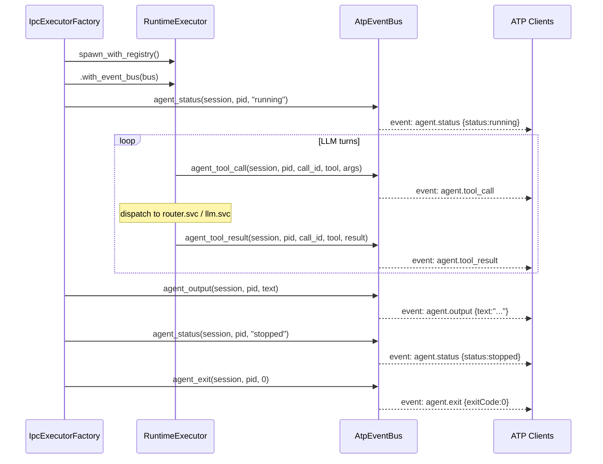
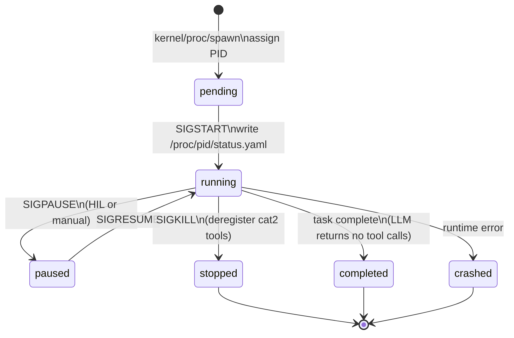

# 06 — Agents

> RuntimeExecutor, agent spawn, proc file writes, the 7-step turn loop, and signals.

---

## Overview

An agent is an LLM conversation loop managed by a `RuntimeExecutor`. The LLM is stateless;
the `RuntimeExecutor` is the actual OS-level process — it owns the conversation context,
enforces capability policy, manages tool dispatch, and handles all kernel interactions.

The LLM **never sees** raw capability tokens, IPC messages, or signal delivery.
Everything is mediated through the tool interface.

---

## Built-in Agents

| Agent | Description | LLM required | Key capabilities |
|-------|-------------|:---:|---|
| `kernel.agent` | System supervisor. Holds `kernel:root`. | Optional | `kernel:root`, `llm:inference` |
| `planner.agent` | Task decomposition. | Yes | `fs:read`, `llm:inference` |
| `executor.agent` | Tool execution loop. | Yes | `fs:read`, `fs:write`, `exec:*`, `llm:inference` |
| `memory.agent` | File indexing and context retrieval. | Yes | `fs:read`, `llm:inference` |
| `observer.agent` | System health monitoring. | Optional | `fs:read`, `kernel:root` |

All agents live in `/bin/<name>@<version>/` (system) or `/users/<username>/bin/<name>@<version>/` (user-installed).

---

## Agent Spawn

An agent is spawned via the `kernel/proc/spawn` syscall. The kernel:

1. Generates a **time-seeded u64 PID** via `Pid::generate()` (42-bit ms timestamp since 2025-01-01 | 22-bit random salt — collision-free across reboots)
2. Issues a `CapabilityToken` (tool grants from crew + user ACL intersection)
3. Creates the `RuntimeExecutor` with the token
4. **Writes `/proc/<pid>/status.yaml` to VFS**
5. **Writes `/proc/<pid>/resolved.yaml` to VFS**
6. Sends `SIGSTART` to the agent

**Session resolution** (in `ProcHandler::spawn`):

The PID is **generated before session resolution** so it can be recorded as `owner_pid` at
session creation time. PIDs are `u64` time-seeded values that survive kernel reboots — old
persisted sessions can never collide with new agents. On the ATP wire format, `pid` fields
are serialised as **JSON strings** to avoid JavaScript float precision loss (`u64 > 2^53`).

| Spawn params | Behavior |
|---|---|
| `parent_pid = Some(ppid)` | Inherit `ppid`'s session (child added as participant); `entry.parent` is set |
| `parent_pid = None`, `session_id` non-empty | Attach to the provided session |
| `parent_pid = None`, `session_id` empty | Create a new session with the newly-allocated PID as `owner_pid` |

`SessionRecord::new()` initialises `pids: vec![owner_pid]`, so the owner PID is already in the
active set when the session is first persisted. When `owner_pid` exits, the session transitions
to `Completed` or `Failed` accordingly. Sessions are **only created by the kernel** — there is
no IPC or ATP endpoint to create a session directly.

### `/proc/<pid>/status.yaml`

Serialized `AgentStatus`. Written at spawn and updated on every lifecycle event.
All keys are `camelCase` in the YAML output.

```yaml
apiVersion: avix/v1
kind: AgentStatus
metadata:
  name: researcher
  pid: 57
  spawnedAt: "2026-03-22T10:00:00Z"
  spawnedBy: alice
status:
  state: running              # pending | running | paused | waiting | stopped | crashed
  goal: "Research Q3 data"
  contextUsed: 5000
  contextLimit: 200000
  toolCallsThisTurn: 2
  lastActivityAt: "2026-03-22T10:05:30Z"
  waitingOn: null             # null | human-approval | pipe-read | pipe-write | signal
  tools:
    granted: [fs/read, llm/complete]
    denied:  [send_email]
  pipes:
    - id: pipe-001
      targetPid: 58
      direction: out          # in | out | bidirectional
      state: open             # open | closed | draining
  signals:
    lastReceived: SIGSTART
    pendingCount: 0
  metrics:
    tokensConsumed: 14200
    toolCallsTotal: 11
    wallTimeSec: 330
```

**Process states:** `pending` (allocated, not yet started) | `running` | `paused` (SIGPAUSE received;
invocation transitions to `Paused`) | `waiting` (blocked on pipe or signal) | `stopped` (SIGKILL received) | `crashed` (runtime error)

### `/proc/<pid>/resolved.yaml`

The merged final configuration this agent runs under. Written at spawn. All keys `camelCase`.

```yaml
apiVersion: avix/v1
kind: Resolved
metadata:
  target: researcher
  resolvedAt: "2026-03-22T10:00:00Z"
  resolvedFor:
    username: alice
    pid: 57
    crews: [researchers]
spec:
  contextWindowTokens: 64000
  maxToolChainLength: 50
  tokenTtlSecs: 3600
  grantedTools:
    - fs/read
    - llm/complete
  annotations: {}
```

**Implementation rule:** These files are written by `RuntimeExecutor::write_proc_files()`
called via `init_proc_files()` after spawn. If no VFS handle is attached, the write is
silently skipped — spawn succeeds regardless.

### `/proc/<pid>/hil-queue/<hil-id>.yaml`

Written by `HilManager::open()` when a HIL event is created. Updated by
`HilManager::resolve()` or timeout. All keys `snake_case` in YAML.

```yaml
api_version: avix/v1
kind: HilRequest
hil_id: hil-abc-001
pid: 57
agent_name: researcher
hil_type: tool_call_approval   # tool_call_approval | capability_upgrade | escalation
tool: send_email
args:
  to: team@org.com
  subject: Summary ready
reason: "Wants to notify user when analysis is complete"
urgency: normal                # low | normal | high
approval_token: "<opaque token — present this in SIGRESUME payload>"
created_at: "2026-03-22T10:05:00Z"
expires_at: "2026-03-22T10:15:00Z"
state: pending                 # pending | approved | denied | timeout
```

Human clients read `approval_token` from this file and include it in the `SIGRESUME`
payload when responding (see `04-atp.md` HIL flow).

---

## Category 2 Tool Registration

At spawn, `RuntimeExecutor` registers Category 2 tools via `ipc.tool-add`:

```
agent/spawn, agent/kill, agent/list
pipe/open, pipe/write, pipe/read, pipe/close
cap/request-tool, cap/escalate, cap/list, cap/list-granted
job/watch
```

These tools are NOT hard-coded in any service's tool list. They are registered by
`RuntimeExecutor` at spawn time and removed via `ipc.tool-remove` at exit. The LLM
always sees an accurate tool list that reflects the agent's actual runtime grants.

**Always-present tools** (regardless of capability grants):
`cap/request-tool`, `cap/escalate`, `cap/list`, `job/watch`

---

## The 7-Step Turn Loop

Each turn of the agent loop:

1. **Receive** — get LLM response (text content blocks + tool call requests)
2. **Validate** — check each requested tool against `CapabilityToken.granted_tools`
3. **HIL check** — if any tool is in `hilRequiredTools` policy list, pause for approval
4. **Dispatch** — send validated tool calls to `router.svc` via IPC
5. **Collect** — gather all tool results
6. **Inject** — add results to conversation context
7. **Continue** — feed updated context back to LLM, or exit if task complete

Category 3 (transparent) behaviours run automatically within the loop:
- Token renewal when expiry is within `renewalWindowSecs`
- HIL pausing on `hilRequiredTools` hits
- Snapshot triggers on `SIGSAVE`
- Tool chain depth enforcement



---

## Signals

### Signal kinds

| Signal | Direction | Meaning |
|--------|-----------|---------|
| `SIGSTART` | Kernel → Agent | Begin execution |
| `SIGPAUSE` | Kernel → Agent | Suspend at next tool boundary; payload carries `hilId` for HIL pauses |
| `SIGRESUME` | Kernel → Agent | Resume; payload carries HIL decision |
| `SIGKILL` | Kernel → Agent | Terminate immediately |
| `SIGSTOP` | Kernel → Agent | Stop (session closed) |
| `SIGSAVE` | Kernel → Agent | Take a snapshot now |
| `SIGPIPE` | Kernel → Agent | Pipe established/closed |
| `SIGESCALATE` | Agent → Kernel | Agent proactively requests human escalation |

`SIGRESUME` payload (capability upgrade approved):

```json
{
  "hilId": "hil-002",
  "decision": "approved",
  "scope": "session",
  "new_capability_token": "<full new HMAC-signed token>"
}
```

`RuntimeExecutor` replaces its held token when `new_capability_token` is present.

### In-process signal delivery (executor path)

Signals to running executor tasks are delivered via an **in-process channel**, not sockets.

**Why not sockets?** Each `RuntimeExecutor` runs as a Tokio task inside the kernel process.
Routing signals through Unix sockets would require the executor to start a socket listener,
adding round-trip latency and a race between executor startup and signal arrival. The
in-process channel is zero-copy, instant, and has no setup cost.

**`SignalChannelRegistry`** — a shared `Arc<Mutex<HashMap<u32, mpsc::Sender<Signal>>>>`:

```
SignalChannelRegistry (Arc-shared)
      │
      ├── IpcExecutorFactory  — registers sender at executor launch,
      │                         deregisters on exit
      │
      └── SignalHandler       — calls registry.send(pid, signal) instead of
                                writing to a socket
```

**Lifecycle:**
1. Bootstrap creates one `SignalChannelRegistry` in Phase 2.
2. Both `IpcExecutorFactory` and `ProcHandler` receive a clone of the same registry.
3. When `IpcExecutorFactory::launch()` starts an executor task, it immediately calls
   `signal_channels.register(pid, executor.signal_sender())`.
4. `SignalHandler` (called by `ProcHandler`) calls `signal_channels.send(pid, sig)` — this
   drops the signal into the executor's `mpsc::Receiver` with no IPC.
5. On exit (success or error), the factory calls `signal_channels.unregister(pid)`.

**Signal interruption of in-flight LLM calls:**

`run_with_client` races the LLM turn future against the signal receiver using
`tokio::select!`. When a signal arrives while the LLM is streaming, the select branch wins,
cancels the streaming future via `CancellationToken`, then handles the signal:

```
tokio::select! {
    res = run_turn_streaming(req, cancel.clone()) => { ... }
    sig = signal_rx.recv()                        => {
        cancel.cancel();           // abort the in-flight LLM stream
        handle_signal_during_llm(sig);
        if killed → return Err(Cancelled)
        else      → continue (re-enters loop; pause-wait if SIGPAUSE)
    }
}
```

Between turns, pending signals are drained synchronously. If `paused` is set, the loop
blocks in a `signal_rx.recv()` wait until `SIGRESUME` arrives.

**SIGPIPE (pipe manager path):** `PipeManager::close` uses `SignalChannelRegistry` to
deliver `SIGPIPE` to the partner agent in-process — the same registry, not sockets.

---

## ATP Event Emission

`RuntimeExecutor` and `IpcExecutorFactory` publish events to `AtpEventBus` throughout
the agent lifecycle. The bus is a tokio `broadcast::Sender` — all connected WebSocket
clients with the right subscription and role receive these events in real time.



On crash, `IpcExecutorFactory` publishes `agent.status = "crashed"` and `agent.exit(1)`
instead of the success path.

---

## Agent Status Lifecycle



```
kernel.proc/spawn
  → status: running
  → /proc/<pid>/status.yaml written

SIGPAUSE
  → status: paused
  → /proc/<pid>/status.yaml updated

SIGRESUME
  → status: running
  → /proc/<pid>/status.yaml updated

task complete (LLM returns no tool calls)
  → status: completed
  → /proc/<pid>/status.yaml updated

SIGKILL
  → status: stopped
  → token invalidated
  → Category 2 tools deregistered via ipc.tool-remove
  → /proc/<pid>/status.yaml updated
```

---

## Defaults and Limits Resolution Order

For any agent configuration value:

```
/kernel/limits/agent.yaml      (hard ceiling — kernel enforced)
    ↓
/users/<username>/limits.yaml  (per-user ceiling)
    ↓
/users/<username>/defaults.yaml (per-user preference)
    ↓
/kernel/defaults/agent.yaml    (compiled-in system defaults)
```

The merged result is written to `/proc/<pid>/resolved.yaml` at spawn time.

---

## Pipes

Agents communicate via pipes. A pipe is an ordered, backpressure-aware channel between
two agents.

```
pipe/open   → creates /proc/<pid>/pipes/<id>.yaml; SIGPIPE delivered to both ends
pipe/write  → writes content to buffer (blocks if buffer full — backpressure)
pipe/read   → reads from buffer
pipe/close  → closes and cleans up
```

Pipe configuration defaults from `/kernel/defaults/pipe.yaml` (`bufferTokens: 8192`).

---

## Snapshots

Snapshots give agents cross-session continuity. A snapshot is a YAML file written to
`/users/<username>/snapshots/<name>.yaml` that captures enough state to restart an
agent where it left off.

### Triggers

| Trigger | Source |
|---------|--------|
| `sigsave` | `SIGSAVE` received from kernel (e.g. session close, scheduled) |
| `auto` | Background auto-snapshot interval (configured in `kernel.yaml`) |
| `manual` | Agent calls `snap/save` syscall |
| `crash` | Kernel detects agent crash and captures last-known state |

### `SnapshotFile` Schema

Written to `/users/<username>/snapshots/<agentName>-<YYYYMMDD>-<HHMM>.yaml`.
All keys are `camelCase`. The file is integrity-protected by a SHA-256 checksum.

```yaml
apiVersion: avix/v1
kind: Snapshot
metadata:
  name: researcher-20260315-0741          # <agentName>-<YYYYMMDD>-<HHMM>
  agentName: researcher
  sourcePid: 57                           # PID at capture time
  capturedAt: "2026-03-15T07:41:00Z"
  capturedBy: kernel                      # kernel | user:<uid> | agent:<pid>
  trigger: sigsave                        # auto | crash | manual | sigsave
spec:
  goal: "Research Q3 revenue trends"
  contextSummary: "Found 12 sources. Synthesising..."
  contextTokenCount: 64000
  memory:
    episodicEvents: 14                    # count from memory.svc at capture
    semanticKeys: 8
  pendingRequests:
    - requestId: req-abc124
      resource: tool
      name: web
      status: in-flight
  pipes:
    - pipeId: pipe-001
      state: open
  environment:
    temperature: 0.7
    capabilityToken: sha256:tokenSig789   # fingerprint of token at capture
    grantedTools:                         # tool list used to issue a fresh token on restore
      - fs/read
      - llm/complete
  checksum: sha256:abc123...              # SHA-256 over canonical YAML with this field zeroed
```

**Checksum integrity:** The checksum is computed over the YAML with `checksum` set to `""`.
On restore, `verify_checksum()` recomputes and compares — tampered snapshots are rejected.

### Capture Flow

```
SIGSAVE / snap/save / auto-interval
  → RuntimeExecutor::capture_and_write_snapshot(trigger, captured_by)
      → capture(CaptureParams) → build SnapshotFile + embed sha256 checksum
      → snap.to_yaml() → VfsRouter::write(/users/<username>/snapshots/<name>.yaml)
      → tracing::info("snapshot written")
```

If no VFS is attached, the snapshot is silently skipped — the executor continues normally.

For SIGSAVE arriving via the in-process signal channel, `handle_signal_between_turns`
sets `snapshot_requested: AtomicBool`. The main turn loop picks this up at the next
turn boundary and calls `capture_and_write_snapshot`.

For `deliver_signal("SIGSAVE")` (test path), `capture_and_write_snapshot` is called
directly in the same async context.

### Restore Flow

```
restore_from_snapshot(snapshot_name)
  1. Read YAML from VFS (/users/<username>/snapshots/<name>.yaml)
  2. verify_checksum() — aborts with AvixError on mismatch
  3. Issue fresh CapabilityToken from spec.environment.grantedTools
  4. Restore goal and conversation context from spec.contextSummary
  5. Collect pending in-flight requests → RestoreResult.reissued_requests
  6. Collect open pipes → RestoreResult.sigpipe_pipes (kernel delivers SIGPIPE to each)
```

`restore_from_snapshot` returns a `RestoreResult`:

```rust
pub struct RestoreResult {
    pub snapshot_name: String,
    pub agent_name: String,
    pub reissued_requests: Vec<String>,    // request IDs to re-issue
    pub reconnected_pipes: Vec<String>,   // pipes that reconnected
    pub sigpipe_pipes: Vec<String>,       // pipes whose target was gone → SIGPIPE
}
```

The restored conversation context is a synthetic `assistant` message:

```
[Restored from snapshot '<name>']

Context at capture:
<contextSummary>
```

This primes the LLM with the prior session's last known state without unbounded context growth.

### `CapturedBy` Encoding

| Value | Meaning |
|-------|---------|
| `kernel` | Kernel-triggered (SIGSAVE, auto-interval, crash) |
| `user:1001` | Human user with UID 1001 triggered via ATP `snap.create` |
| `agent:57` | Agent at PID 57 triggered via `snap/save` syscall |

### Snapshot Syscalls

| Syscall | Description |
|---------|-------------|
| `snap/save` | Trigger a manual snapshot of the calling agent |
| `snap/list` | List all snapshots for the calling agent |
| `snap/delete` | Delete a named snapshot |
| `snap/restore` | Restore calling agent from a named snapshot |

---

## Agent Discovery

Installed agents are enumerated by `ManifestScanner` (`crates/avix-core/src/agent_manifest/scanner.rs`).

It scans two VFS directories:

| Tree | Scope | ATP op |
|------|-------|--------|
| `/bin/<name>@<version>/manifest.yaml` | System — all users | `proc/list-installed` |
| `/users/<username>/bin/<name>@<version>/manifest.yaml` | User — personal installs | `proc/list-installed` |

System agents take precedence: if the same agent `name` appears in both trees, only the system version is returned.

See `docs/architecture/14-agent-persistence.md` for the full discovery specification.

---

## Invocation Records

Every `kernel/proc/spawn` creates a persistent `InvocationRecord` that survives daemon restart.

```
kernel/proc/spawn
  → InvocationRecord { status: Running } written to InvocationStore
  → invocation_id threaded through SpawnParams → RuntimeExecutor
  → PID registered in SessionRecord.pids

RuntimeExecutor::shutdown_with_status(status, exit_reason)
  → conversation flushed to JSONL
  → InvocationRecord finalized (status, ended_at, tokens, tool_calls)

kernel/proc/kill (abort_agent)
  → InvocationRecord finalized with status: Killed
  → ProcHandler::finalize_session_for_pid removes PID from session
  → If PID == session.owner_pid: session transitions to Completed/Failed

SIGPAUSE received by RuntimeExecutor
  → InvocationRecord status updated to Paused (non-terminal)
  → If PID == session.owner_pid: all other session PIDs also paused, session marked Paused

SIGRESUME received by RuntimeExecutor
  → InvocationRecord status updated back to Running
  → If session was Paused: all PIDs resumed, session marked Running
```

**`InvocationStatus` states:**

| Status | Terminal | Description |
|--------|----------|-------------|
| `Running` | No | Agent is executing |
| `Idle` | No | Waiting for input (can resume) |
| `Paused` | No | Suspended by SIGPAUSE — HIL wait or manual pause |
| `Completed` | Yes | Task finished successfully |
| `Failed` | Yes | Agent encountered an error |
| `Killed` | Yes | Forcibly terminated via SIGKILL |

Disk artefacts (written by kernel via `LocalProvider` to `AVIX_ROOT/users/`):

```
users/<username>/agents/<agent>/invocations/
├── <uuid>.yaml              ← summary
└── <uuid>/conversation.jsonl
```

ATP query interface:

| Op | Description |
|----|-------------|
| `proc/list-installed` | All agents available to a user |
| `proc/invocation-list` | All invocations for a user (optional agent_name filter) |
| `proc/invocation-get` | Single invocation by UUID |

See `docs/architecture/14-agent-persistence.md` for full specification.

