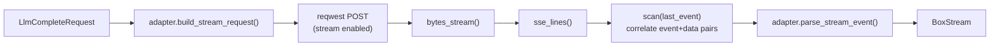
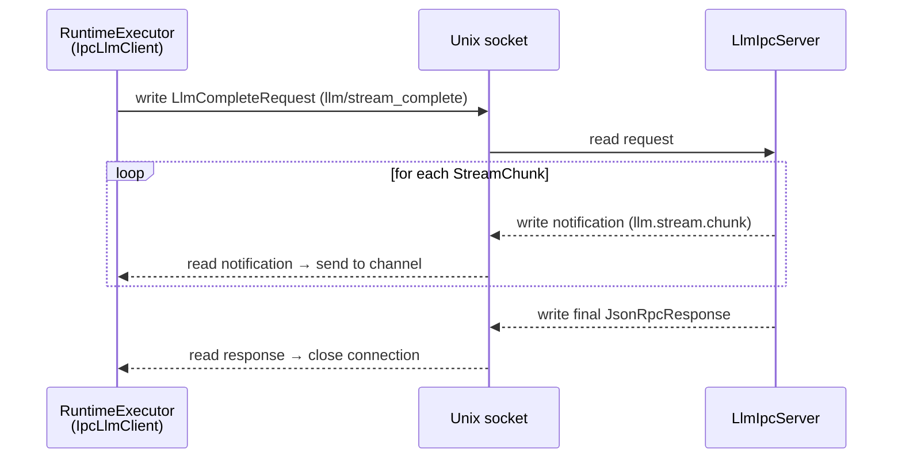
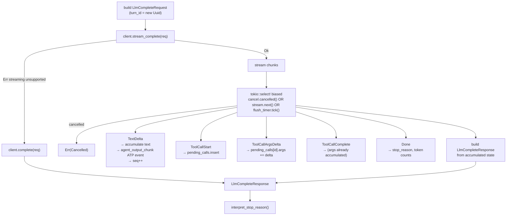
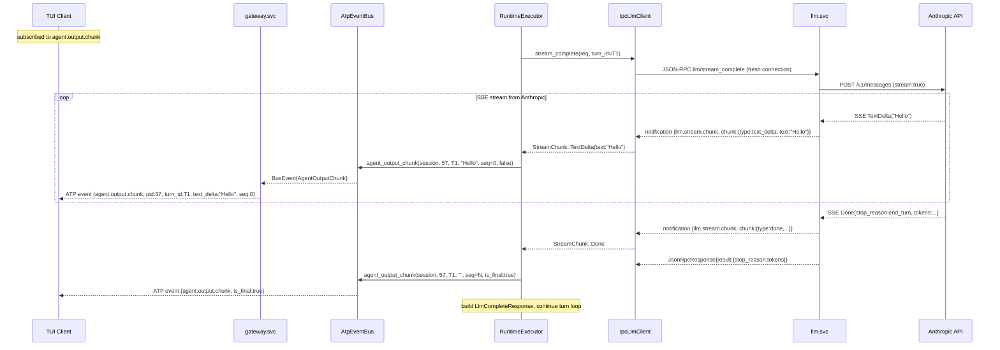

# 13 — LLM Streaming Pipeline

> Token-by-token LLM output delivered end-to-end: from provider SSE over HTTP, through
> IPC notifications, through ATP WebSocket events, to the TUI — without buffering a full
> response.

---

## Overview

Before streaming, `RuntimeExecutor` waited for a complete `LlmCompleteResponse` before
publishing any output. Users saw nothing until the entire LLM turn finished — often
several seconds. Streaming eliminates this latency by propagating each text token as it
arrives from the provider.

The pipeline spans five layers:

```
Provider (Anthropic / OpenAI / xAI / Ollama)
  └─ HTTP SSE stream ──────────────────────────────────────────────── ProviderAdapter
       └─ DirectHttpLlmClient::stream_complete()  (StreamChunk stream)
            └─ LlmIpcServer  (llm.stream.chunk notifications over IPC)
                 └─ IpcLlmClient::stream_complete()  (StreamChunk stream)
                      └─ RuntimeExecutor::run_turn_streaming()
                           └─ AtpEventBus::agent_output_chunk()  (ATP event)
                                └─ TUI  (token appended to agent panel)
```

---

## StreamChunk: The Streaming Unit

`StreamChunk` is the canonical intermediate representation. Every layer above the HTTP
boundary operates on this type rather than raw SSE text.

```rust
#[derive(Debug, Clone, Serialize, Deserialize)]
#[serde(tag = "type", rename_all = "snake_case")]
pub enum StreamChunk {
    /// One or more tokens of generated text.
    TextDelta { text: String },

    /// A new tool call has started — name is known, args accumulate via deltas.
    ToolCallStart { call_id: String, name: String },

    /// Partial JSON arguments for a tool call in progress.
    ToolCallArgsDelta { call_id: String, args_delta: String },

    /// All arguments for a tool call have been received.
    ToolCallComplete { call_id: String },

    /// The turn is done — includes final token counts and stop reason.
    Done {
        stop_reason: StopReason,
        input_tokens: u32,
        output_tokens: u32,
    },
}
```

Defined in `crates/avix-core/src/llm_client/mod.rs`.

---

## Turn Correlation: `turn_id`

Every `LlmCompleteRequest` carries a `turn_id: uuid::Uuid` generated by
`RuntimeExecutor` at the start of each turn. It is propagated through:

1. `LlmCompleteRequest.turn_id` → IPC params → `llm.svc`
2. `llm.svc` → `llm.stream.chunk` notification params (`stream_id` field)
3. `RuntimeExecutor` → `AtpEventBus::agent_output_chunk()` → ATP `agent.output.chunk` body

Clients can correlate all `agent.output.chunk` events for a single turn using
`(pid, turn_id)`. This is essential for multi-agent sessions where multiple agents
produce output concurrently.

---

## Layer 1: Provider SSE

All major providers emit Server-Sent Events (SSE) over a streaming HTTP response.
The SSE format is line-based:

```
event: content_block_delta
data: {"type":"content_block_delta","index":0,"delta":{"type":"text_delta","text":"Hello"}}

event: message_delta
data: {"type":"message_delta","usage":{"output_tokens":42}}

data: [DONE]
```

### SSE Parser (`llm_svc/sse.rs`)

A shared SSE parser converts the raw byte stream from `reqwest` into a typed stream:

```rust
pub enum SseLine {
    Event(String),   // event: <name>
    Data(String),    // data: <json>
    Done,            // data: [DONE]
}

pub fn sse_lines(
    byte_stream: impl Stream<Item = reqwest::Result<Bytes>>,
) -> impl Stream<Item = anyhow::Result<SseLine>>
```

The parser handles TCP chunking (data split across packets), CRLF line endings,
comment lines (`:` prefix), and the `[DONE]` sentinel.

### ProviderAdapter Extensions

Each adapter implements provider-specific SSE parsing via new trait methods:

```rust
trait ProviderAdapter {
    /// HTTP path for non-streaming completion (default: /v1/chat/completions)
    fn complete_path(&self) -> &str;

    /// HTTP path for streaming (defaults to complete_path)
    fn stream_complete_path(&self) -> &str;

    /// Add stream:true (and provider-specific fields) to the request body
    fn build_stream_request(&self, req: &AvixCompleteRequest) -> serde_json::Value;

    /// Parse one SSE event+data pair into a StreamChunk
    fn parse_stream_event(
        &self,
        event_name: Option<&str>,
        data: &str,
    ) -> Result<Option<StreamChunk>, AdapterError>;
}
```

#### Provider-specific paths and URLs

| Provider | `complete_path()` | Notes |
|---|---|---|
| Anthropic | `/v1/messages` | Anthropic uses a different endpoint than OpenAI |
| OpenAI | `/v1/chat/completions` | Default |
| xAI | `/v1/chat/completions` | OpenAI-compatible |
| Ollama | `/v1/chat/completions` | OpenAI-compatible |

> **Bug fixed:** Before streaming was added, `DirectHttpLlmClient` hardcoded
> `/v1/chat/completions` for all providers. Anthropic's API lives at `/v1/messages`.
> The `complete_path()` override on `AnthropicAdapter` corrects this.

#### Anthropic SSE event mapping

| SSE event | → StreamChunk |
|---|---|
| `content_block_start` (type=tool_use) | `ToolCallStart { call_id: index, name }` |
| `content_block_delta` (text_delta) | `TextDelta { text }` |
| `content_block_delta` (input_json_delta) | `ToolCallArgsDelta { call_id: index, args_delta }` |
| `content_block_stop` | `ToolCallComplete { call_id: index }` |
| `message_delta` (stop_reason + usage) | `Done { stop_reason, input_tokens, output_tokens }` |

Note: Anthropic's `content_block_delta` for tool input identifies blocks by array
`index`, not by the tool call `id`. The index is used as the `call_id` proxy during
streaming; `RuntimeExecutor` matches by position in the accumulated tool call list.

#### OpenAI SSE event mapping

| SSE data field | → StreamChunk |
|---|---|
| `choices[0].delta.content` (non-null) | `TextDelta { text }` |
| `choices[0].delta.tool_calls[n]` (new index) | `ToolCallStart { call_id, name }` |
| `choices[0].delta.tool_calls[n].function.arguments` | `ToolCallArgsDelta { call_id, args_delta }` |
| `choices[0].finish_reason` = `"tool_calls"` | `ToolCallComplete` for each pending call |
| `choices[0].finish_reason` (non-null) + `usage` | `Done { stop_reason, input_tokens, output_tokens }` |

xAI and Ollama delegate to the OpenAI adapter (both are OpenAI-compatible).

---

## Layer 2: DirectHttpLlmClient Streaming

`DirectHttpLlmClient::stream_complete()` wires the SSE parser to the provider adapter:



The `scan` combinator tracks the last `event:` line name so `parse_stream_event` always
receives the correct event context alongside the `data:` line.

Returns `BoxStream<'static, anyhow::Result<StreamChunk>>`.

---

## Layer 3: IPC Streaming (Bidirectional Connection)

Standard IPC uses **fresh connection per call** (ADR-05): connect → write request →
read single response → close. Streaming extends this: **one connection per logical
streaming call, kept open until the stream ends**.

### `IpcServer::serve_bidir()`

A new server mode that passes the write half of the connection to the handler, enabling
the handler to push multiple notification frames before sending the final response:

```rust
pub async fn serve_bidir<F, Fut>(mut self, handler: F) -> Result<(), AvixError>
where
    F: Fn(IpcMessage, OwnedWriteHalf) -> Fut + Send + Sync + 'static,
    Fut: Future<Output = ()> + Send + 'static,
```

`LlmIpcServer` uses `serve_bidir()`. Each connection is split into read and write halves
at accept time. The write half is passed to the handler for multi-frame streaming.

### `llm/stream_complete` IPC method

When `RuntimeExecutor` (via `IpcLlmClient`) calls `llm/stream_complete`, the server:

1. Routes to `LlmService::dispatch_stream()` → `LlmClient::stream_complete()`
2. Loops over `StreamChunk` items from the provider stream
3. For each chunk, writes a `JsonRpcNotification` on the connection:

```json
{
  "jsonrpc": "2.0",
  "method": "llm.stream.chunk",
  "params": {
    "stream_id": "<request-id>",
    "chunk": {
      "type": "text_delta",
      "text": "Hello"
    }
  }
}
```

4. After the stream ends, writes the final `JsonRpcResponse`:

```json
{
  "jsonrpc": "2.0",
  "id": "<request-id>",
  "result": {
    "stop_reason": "end_turn",
    "input_tokens": 512,
    "output_tokens": 87
  }
}
```

The client distinguishes notifications (no `"id"` field, has `"method"`) from the final
response (has `"id"`, no `"method"`).

### IPC Streaming Wire Diagram



### `IpcLlmClient::stream_complete()`

The client side:
1. Opens a fresh connection and writes the `llm/stream_complete` request
2. Spawns a `tokio::task` to read frames from the socket
3. Sends each `StreamChunk` to a bounded `mpsc::channel` (capacity 64)
4. Returns `BoxStream` backed by the channel receiver via `futures::stream::unfold`

The spawned task distinguishes notification frames (has `"method"`) from the final
response (has `"result"` or `"error"`), and terminates when the response arrives.
The `OwnedWriteHalf` is held inside the task to prevent the server from seeing a
premature half-close.

---

## Layer 4: RuntimeExecutor Streaming

### `run_turn_streaming()`

Called once per iteration of the `run_with_client` loop. Prefers streaming; falls back
to `complete()` transparently if the client reports streaming is unsupported.

The function accepts a `CancellationToken` so an in-flight LLM stream can be aborted
immediately when a signal (SIGKILL, SIGPAUSE, SIGSTOP) arrives via the signal channel:



### `run_with_client` — signal-aware turn loop

`run_with_client` owns the outer loop and races each LLM turn against the in-process
signal receiver:

```
loop {
  // 1. drain pending signals (between-turn)
  while signal_rx.try_recv() → handle_signal_between_turns()
  // 2. pause-wait if paused
  if paused { loop { signal_rx.recv().await → until SIGRESUME } }

  // 3. race LLM turn vs signal
  tokio::select! {
    res = run_turn_streaming(req, cancel.clone()) => { ... }
    sig = signal_rx.recv() => {
      cancel.cancel();
      handle_signal_during_llm(sig);
      if killed → return Err(Cancelled)
      continue   // SIGPAUSE or SIGPIPE/SIGSAVE: re-enter loop
    }
  }
}
```

`handle_signal_between_turns` and `handle_signal_during_llm` both update atomics
(`paused`, `killed`, `snapshot_requested`) and respond to SIGPIPE/SIGSAVE inline.

### Accumulating a synthetic `LlmCompleteResponse`

After the stream ends, `run_turn_streaming` builds a `LlmCompleteResponse` that matches
the shape `interpret_stop_reason` expects, so the existing tool-dispatch loop works
unchanged:

```rust
// Text block
content.push(json!({"type": "text", "text": accumulated_text}));

// Tool use blocks
for (call_id, (name, args_str)) in &pending_calls {
    let input = serde_json::from_str(args_str).unwrap_or(json!({}));
    content.push(json!({
        "type": "tool_use",
        "id": call_id,
        "name": name,
        "input": input,
    }));
}
```

### ATP event emission

For every `TextDelta` chunk, `run_turn_streaming` emits an `agent.output.chunk` event:

```rust
bus.agent_output_chunk(
    &self.session_id,
    self.pid.as_u32(),
    &turn_id.to_string(),
    &text,          // the token delta
    seq,            // monotonically increasing per turn
    false,          // is_final
);
```

A final sentinel is emitted with `text_delta: ""` and `is_final: true` after the stream
ends, allowing clients to stop streaming indicators.

---

## Layer 5: ATP `agent.output.chunk` Event

### New event kind

`agent.output.chunk` joins the ATP server-push event table:

| Event | Min role | Owner-scoped | When emitted | Source |
|---|---|:---:|---|---|
| `agent.output.chunk` | `user` | yes | Each text token delta during a streaming turn | RuntimeExecutor |

Clients must subscribe to `"agent.output.chunk"` (or `"*"`) to receive token streaming.

### Body schema

```json
{
  "type": "event",
  "event": "agent.output.chunk",
  "sessionId": "sess-abc-123",
  "body": {
    "pid": 57,
    "turn_id": "f47ac10b-58cc-4372-a567-0e02b2c3d479",
    "text_delta": "Hello",
    "seq": 4,
    "is_final": false
  }
}
```

| Field | Type | Description |
|---|---|---|
| `pid` | u64 | PID of the agent producing the output |
| `turn_id` | UUID string | Correlates all chunks from one LLM turn |
| `text_delta` | string | Token(s) to append. Empty string on the final sentinel. |
| `seq` | u64 | Monotonically increasing within a turn. Gaps indicate dropped events. |
| `is_final` | bool | `true` on the last chunk of a turn (sentinel, `text_delta` is empty) |

### Relationship with `agent.output`

`agent.output` (the existing event) is **not deprecated**. It is still emitted by
`IpcExecutorFactory` at the end of a turn with the complete accumulated text. This
preserves backwards compatibility:

- Clients that subscribe to **`agent.output.chunk`** get token-by-token streaming.
- Clients that subscribe to **`agent.output`** get the complete turn text as before.
- Clients that subscribe to **both** can show progressive streaming and then confirm
  completeness on `agent.output`.

---

## Full End-to-End Sequence



---

## TUI Handling

`dispatch_event()` in `crates/avix-cli/src/tui/app.rs` handles the new event kind:

```rust
EventKind::AgentOutputChunk => {
    if let EventBody::AgentOutputChunk(body) = event.body {
        if !body.is_final && !body.text_delta.is_empty() {
            let _ = action_tx
                .send(Action::UpdateAgentOutput(body.pid, body.text_delta))
                .await;
        }
    }
}
```

`Action::UpdateAgentOutput` appends the delta to the agent's output buffer in `TuiState`,
which causes the agent output panel to re-render on the next 100 ms poll cycle. The
result is token-by-token display as the LLM generates.

---

## Fallback Behaviour

`run_turn_streaming` calls `stream_complete()` first. If the client returns an error
(e.g., `"streaming not supported by this LLM client"`), it falls back to the standard
blocking `complete()` call. This means:

- Any `LlmClient` implementation that only overrides `complete()` continues to work
  without modification.
- Streaming is opt-in at the client level: implement `stream_complete()` to enable it.
- The `DefaultHttpLlmClient` (used via `IpcLlmClient` → `llm.svc`) always supports
  streaming for the four built-in adapters (Anthropic, OpenAI, xAI, Ollama).

---

## Architectural Invariants (updated)

These extend the invariants in `CLAUDE.md`:

**ADR-05 (extended):** The "fresh connection per call" rule applies to streaming calls
too — one connection per logical streaming call. The connection is held open until the
stream ends (final `JsonRpcResponse` received), then closed. There is no connection
multiplexing or persistent channel.

**No streaming across the ATP boundary:** ATP clients receive `agent.output.chunk`
events pushed over the existing WebSocket. ATP itself does not expose an SSE or
streaming endpoint. The gateway translates the broadcast bus events into WebSocket
frames as it does for all other events.

**`llm.svc` owns all streaming inference:** `RuntimeExecutor` never opens an SSE
connection to a provider directly. All streaming goes through `llm.svc` (ADR-02).

---

## File Index

| File | Role |
|---|---|
| `crates/avix-core/src/llm_client/mod.rs` | `StreamChunk`, `turn_id` on `LlmCompleteRequest`, `stream_complete()` on `LlmClient` trait |
| `crates/avix-core/src/llm_svc/sse.rs` | SSE byte-stream → `SseLine` parser |
| `crates/avix-core/src/llm_svc/adapter/mod.rs` | `ProviderAdapter` streaming trait methods |
| `crates/avix-core/src/llm_svc/adapter/anthropic.rs` | Anthropic SSE → `StreamChunk` + `/v1/messages` path |
| `crates/avix-core/src/llm_svc/adapter/openai.rs` | OpenAI SSE → `StreamChunk` |
| `crates/avix-core/src/llm_svc/adapter/xai.rs` | delegates to OpenAI adapter |
| `crates/avix-core/src/llm_svc/adapter/ollama.rs` | delegates to OpenAI adapter |
| `crates/avix-core/src/llm_svc/http_client.rs` | `DirectHttpLlmClient::stream_complete()` |
| `crates/avix-core/src/ipc/server.rs` | `IpcServer::serve_bidir()` |
| `crates/avix-core/src/llm_svc/ipc_server.rs` | `llm/stream_complete` handler, `llm.stream.chunk` notifications |
| `crates/avix-core/src/llm_svc/service.rs` | `LlmService::dispatch_stream()` |
| `crates/avix-core/src/llm_client/ipc_client.rs` | `IpcLlmClient::stream_complete()` |
| `crates/avix-core/src/executor/runtime_executor.rs` | `run_turn_streaming()`, ATP event emission |
| `crates/avix-core/src/gateway/atp/types.rs` | `AtpEventKind::AgentOutputChunk` |
| `crates/avix-core/src/gateway/event_bus.rs` | `agent_output_chunk()` helper, event scoping |
| `crates/avix-client-core/src/atp/types.rs` | `EventKind::AgentOutputChunk`, `AgentOutputChunkBody` |
| `crates/avix-cli/src/tui/app.rs` | `AgentOutputChunk` dispatch → `Action::UpdateAgentOutput` |
